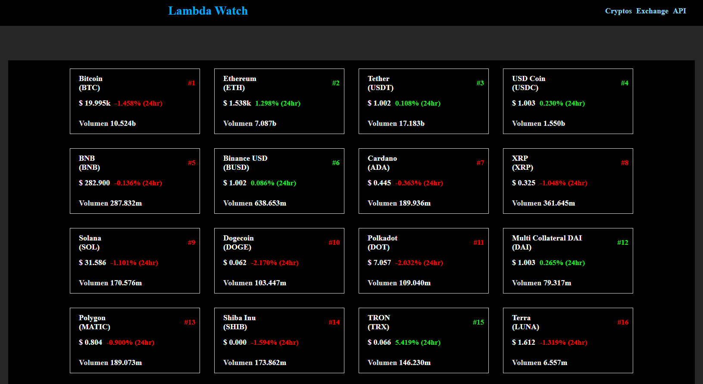
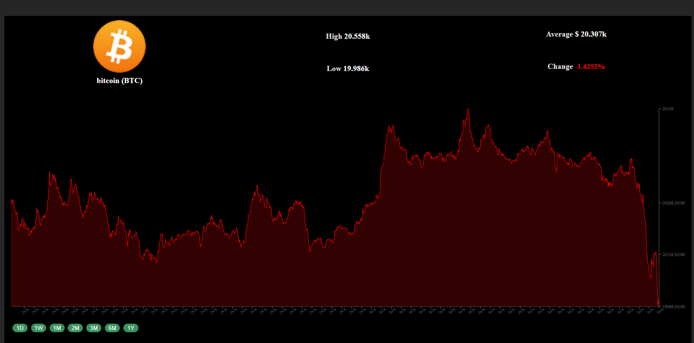

# Crypto Lambda
## Resume
An React App build with React Router, Styled components and Recharts library. 

This app provide to the user the current state of multitple Crypto currency using the Coincap API. The live site is deployed in Netlify
Link: https://crypto-lambda.netlify.app/
## Main Page

## Detail coin page

## Commands

 - npm install --> Install all dependencies
 - npm run dev --> Build dev bundler
 - npm run start --> Start development server
 - npm run build --> Build production bundler
